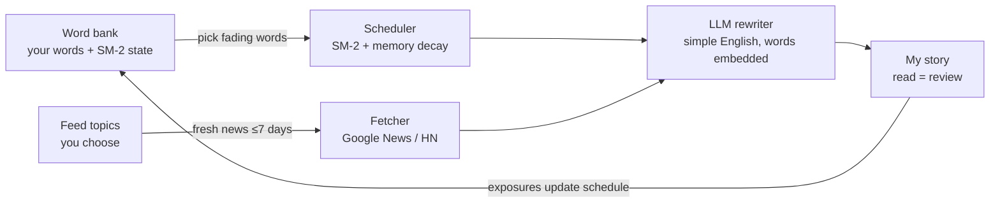

# LesMots · 温故

**To learn the new by reviewing the old.** (中文名：温故，取自「温故而知新」)

[](https://github.com/marinelj/lesMots/actions/workflows/ci.yml)
[](LICENSE)

**Live app:** https://lesmots-936108631310.europe-west1.run.app

---

## The problem

Vocabulary apps drill words as isolated flashcards. You "know" the word in the app and
forget it everywhere else, because you never meet it in the wild — and the review itself
is a chore you eventually skip. Meanwhile, reading real articles in a foreign language
*would* teach you words in context, but real articles don't care which words you're
struggling with, and they're usually too hard.

## The idea

LesMots flips the review around: **instead of bringing you to the words, it brings the
words to you — inside today's news you actually want to read.**

Every day it:

1. looks at your word bank and asks *"which words is this learner about to forget?"* —
   using SM-2 spaced repetition plus an Ebbinghaus-style memory-decay curve;
2. fetches a fresh story (published within the last 7 days) matching topics you picked —
   AI, sports, history, anything;
3. has an LLM rewrite that story into short, simple English that deliberately weaves in
   exactly those fading words.

Reading the story **is** the review. Every embedded word you meet gets its exposure
counted and its schedule pushed out; words you neglect decay back toward "unfamiliar"
and start showing up in stories again. No flashcards, no drills — just a daily read
that quietly keeps your vocabulary alive.

## How it works



In the app that loop looks like:

- **Explain & Add** — type a word, phrase, or sentence; get a one-line explanation in
  simple English plus your native language. Misspell it and LesMots suggests what you
  meant (pick to confirm).
- **New Journey** — get today's story, with your bank words highlighted on a red→green
  gradient that shows how well you know each one.
- **Keep reading** — extend the story with one more coherent paragraph carrying more of
  your words.
- **I Love This** — keep a story forever in your loved-stories library.
- **Original** — pop up the untouched source article side-by-side with your story, plus
  a GitHub-style diff of what the rewrite changed.
- **Word bank** — every entry with its exposure count and a 1–5 familiarity you can
  change with one click (it snaps the review schedule to match).
- **Google sign-in** — every user gets a fully isolated bank, story library, and feed.

## The memory model

Scheduling is simplified SM-2 (`src/lesmots/srs.py`): every exposure in a story counts
as a "good" review, growing the word's interval by its ease factor — well-known words
appear less often. Familiarity (1 = completely unfamiliar … 5 = very familiar) is
derived from that interval, **discounted by a forgetting curve**: the effective interval
halves for every interval-length period a word goes unseen past its due date. Neglected
words visibly fade in the UI and get picked for stories again — exactly like memory.

## Quick start

```bash
git clone https://github.com/marinelj/lesMots && cd lesMots
pip install -e ".[dev]"
```

Requires Python 3.9+. **Zero runtime dependencies** — stdlib only.

### Choose an LLM provider

```bash
# Option A — Anthropic
export ANTHROPIC_API_KEY=sk-ant-...

# Option B — any OpenAI-compatible provider (DeepSeek, Qwen, GLM, Moonshot, OpenAI, Ollama...)
export LESMOTS_API_KEY=sk-...
export LESMOTS_API_BASE=https://api.deepseek.com
export LESMOTS_MODEL=deepseek-chat
```

More option-B examples: Qwen/DashScope (`https://dashscope.aliyuncs.com/compatible-mode/v1`,
`qwen-plus`), local Ollama (`http://localhost:11434/v1`, any local model, key can be
anything). Without any key, LesMots still runs with a simple non-LLM fallback rewriter.

### Run it

```bash
lesmots serve            # web UI at http://127.0.0.1:8321
```

Or live in the terminal:

```bash
lesmots add "state of the art"        # add + explain (default language: Chinese)
lesmots add "inference" --lang French
lesmots show-me                       # today's story, updates exposures
lesmots words                         # word bank table
lesmots config --interests "robotics,biotech" --lang Japanese
lesmots daily                         # pre-generate content (cron-friendly)
```

Cron example (every morning at 7): `0 7 * * * lesmots daily` — and if nothing is
prepared when you hit **New Journey**, LesMots generates it on the spot.

## Multi-user with Google sign-in (optional)

By default LesMots is single-user with no login. To require Google sign-in and give
every user an isolated word bank / stories / topics:

1. In Google Cloud Console → *APIs & Services* → *Credentials*, create an **OAuth
   client ID** (Web application) with your app's URL in *Authorized JavaScript origins*.
2. `export LESMOTS_GOOGLE_CLIENT_ID="1234-abc.apps.googleusercontent.com"`

Each Google account then gets its own store under `$LESMOTS_HOME/users/`. Sessions are
signed cookies (30 days); the signing secret is auto-generated at
`$LESMOTS_HOME/session-secret` (override with `LESMOTS_SESSION_SECRET`).

## Configuration

Stored in `~/.lesmots/lesmots.json` (override directory with `LESMOTS_HOME`):

| Key | Default |
|---|---|
| `language` | `Chinese` |
| `interests` | `LLM, AI, state-of-the-art tech` |
| `max_words` | `120` |
| `pick_limit` | `10` |

Env vars: `ANTHROPIC_API_KEY` **or** `LESMOTS_API_KEY` + `LESMOTS_API_BASE`;
`LESMOTS_MODEL` (default `claude-haiku-4-5` on Anthropic, required otherwise);
`LESMOTS_HOME`; `LESMOTS_GOOGLE_CLIENT_ID` (optional SSO).

## Architecture

Deliberately boring: pure-stdlib Python, one JSON document per user, no framework.

| Module | Role |
|---|---|
| `models.py` | `Word` dataclass — SM-2 state, familiarity + decay curve |
| `srs.py` | simplified SM-2 review + word picking |
| `memory.py` | persistent store (word bank, config, stories, loved list) |
| `fetcher.py` | fresh news — Google News RSS, Hacker News fallback |
| `llm.py` | explanations, rewriting, continuation, spell-check (Anthropic or any OpenAI-compatible API) |
| `daily.py` | the daily generate/show/extend jobs |
| `web.py` | stdlib HTTP server: JSON API + auth + sessions |
| `cli.py` | the terminal version |

### Deploying to Cloud Run

The included `Dockerfile` runs `lesmots serve` (binds `0.0.0.0`, honors `PORT`):

```bash
gcloud run deploy lesmots --source . --region REGION --allow-unauthenticated \
  --set-env-vars ANTHROPIC_API_KEY=sk-ant-...
```

**Persistence:** Cloud Run's filesystem is ephemeral. The image sets
`LESMOTS_HOME=/data`; mount a GCS bucket there to keep the word bank:

```bash
gcloud storage buckets create gs://YOUR_BUCKET --location REGION
gcloud run services update lesmots --region REGION \
  --add-volume name=data,type=cloud-storage,bucket=YOUR_BUCKET \
  --add-volume-mount volume=data,mount-path=/data
```

GCS FUSE mounts don't support concurrent writers, so also cap scaling with
`--max-instances 1`. Without the mount the app still works — data just resets when the
instance is replaced.

## Roadmap

- ✅ **[M1 — MVP: the core learning loop, live and multi-user](https://github.com/marinelj/lesMots/milestone/1)** — everything above, shipped.
- 🔜 **M2 — China mainland edition** — WeChat Mini Program UI, WeChat login, Qwen,
  domestic news sources, database-backed persistence, CloudBase hosting.

## Development

```bash
pytest          # offline — network and LLM are mocked
ruff check .
```

Contributions welcome — see [CONTRIBUTING.md](CONTRIBUTING.md).

## License

[MIT](LICENSE)
