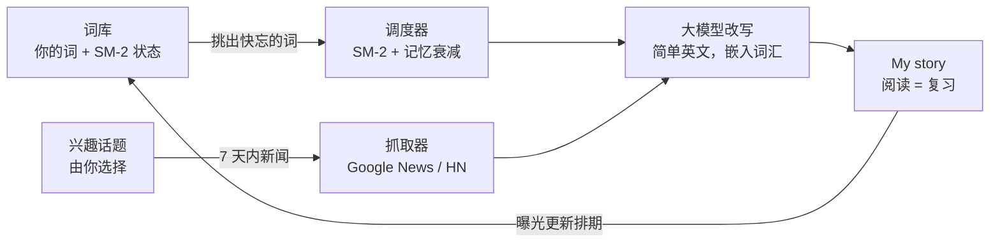

# LesMots · 温故

**温故而知新。**（国际名：LesMots，法语「词语」）

[English](README.md) | **简体中文**

[](https://github.com/marinelj/lesMots/actions/workflows/ci.yml)
[](LICENSE)

**在线体验：** https://lesmots-936108631310.europe-west1.run.app

---

## 要解决的问题

传统背单词应用把词汇做成一张张孤立的卡片：你在应用里"认识"了这个词，出了应用照样想不起来——因为你从未在真实语境中遇见它，而且刷卡片本身枯燥乏味，坚持不了几天。反过来，阅读外语原文虽然能在语境中学词，但真实文章不会照顾你正在攻克的词表，难度也往往过高。

## 我们的思路

LesMots 把复习颠倒过来：**不是把你拉到单词面前，而是把单词送到你面前——嵌进你今天真正想读的新闻里。**

它每天会：

1. 检查你的词库，回答一个问题：*"这位学习者哪些词快忘了？"*——依据 SM-2 间隔重复算法，叠加艾宾浩斯式记忆衰减曲线；
2. 按你选择的话题（AI、体育、历史……都可以）抓取一篇 7 天内的新鲜报道；
3. 让大模型把这篇报道改写成简短易读的英文，并刻意织入那些正在淡忘的词。

**读故事，就是复习。** 故事里出现的每个词都会记一次曝光、推迟下次复习；被冷落的词会逐渐"衰减"回不熟悉状态，重新出现在故事里。没有卡片、没有刷题——只有一篇每天悄悄帮你保鲜词汇的短文。

## 工作原理



在应用里，这个循环对应这些功能：

- **Explain & Add（解释并添加）**——输入单词、短语或句子，立即获得简单英文 + 中文的解释；拼写错误时给出"你想输入的是……"候选，点击确认。
- **New Journey（新旅程）**——获取今日故事，词库中的词以红→绿渐变高亮，颜色代表熟悉度。
- **Keep reading（继续阅读）**——连贯地续写一段，带出更多你的词。
- **I Love This（我喜欢）**——把当前故事永久收藏进故事库。
- **Original（原文）**——弹窗左右对照：左边是你的故事，右边是未改写的原文，附 GitHub 风格的改写对比。
- **词库**——每个词的曝光次数与 1–5 级熟悉度一目了然，熟悉度一键修改（复习排期同步调整）。
- **Google 登录**——每位用户拥有完全隔离的词库、故事库和话题。

## 混合语言故事

词库不限于英文。**任何语言**的词都能加进来——日本語、français、中文、한국어——故事保持它们的原文原样，织入简单英文叙述：

> Scientists reached a new **milestone** in fusion energy — a real **頑張った** moment
> for the team, whose **état de l'art** reactor produced more power than it consumed.

每个嵌入的词都有自己的熟悉度颜色和复习排期，一篇故事可以同时复习你的英语、日语和法语词汇。对多语言学习者来说，LesMots 是一个统一的复习循环，而不是每种语言装一个应用。

## 记忆模型

调度采用简化版 SM-2（`src/lesmots/srs.py`）：故事中的每次曝光算一次"良好"复习，间隔按难度系数增长——越熟的词出现越少。熟悉度（1 = 完全陌生 … 5 = 非常熟悉）由间隔推导，并**叠加遗忘曲线折减**：超过应复习日之后，每过一个间隔周期，有效间隔减半。被冷落的词会在界面上肉眼可见地"褪色"，并重新被挑进故事——和真实记忆一样。

## 快速开始

```bash
git clone https://github.com/marinelj/lesMots && cd lesMots
pip install -e ".[dev]"
```

需要 Python 3.9+。**零运行时依赖**——只用标准库。

### 选择大模型服务

```bash
# 方案 A —— Anthropic
export ANTHROPIC_API_KEY=sk-ant-...

# 方案 B —— 任何 OpenAI 兼容服务（DeepSeek、通义千问、智谱 GLM、月之暗面、OpenAI、Ollama……）
export LESMOTS_API_KEY=sk-...
export LESMOTS_API_BASE=https://api.deepseek.com
export LESMOTS_MODEL=deepseek-chat
```

更多方案 B 示例：通义千问 / DashScope（`https://dashscope.aliyuncs.com/compatible-mode/v1`、`qwen-plus`）、本地 Ollama（`http://localhost:11434/v1`，任意本地模型，密钥随意填）。不配置任何密钥时，LesMots 也能以简单的非大模型兜底方式运行。

### 运行

```bash
lesmots serve            # 网页版 http://127.0.0.1:8321
```

或者用命令行：

```bash
lesmots add "state of the art"        # 添加 + 解释（默认解释语言：中文）
lesmots add "inference" --lang French
lesmots show-me                       # 今日故事，更新曝光
lesmots words                         # 词库表格
lesmots config --interests "robotics,biotech" --lang Japanese
lesmots daily                         # 预生成内容（适合 cron 定时）
```

Cron 示例（每天早上 7 点）：`0 7 * * * lesmots daily`——点 **New Journey** 时若无预生成内容，会现场生成。

## 多用户与 Google 登录（可选）

默认是免登录的单用户模式。要求 Google 登录、并为每位用户隔离词库/故事/话题：

1. 在 Google Cloud Console → *APIs & Services* → *Credentials* 创建 **OAuth 客户端 ID**（Web 应用类型），并把应用网址加入 *Authorized JavaScript origins*；
2. `export LESMOTS_GOOGLE_CLIENT_ID="1234-abc.apps.googleusercontent.com"`

每个 Google 账号的数据存放在 `$LESMOTS_HOME/users/` 下。会话为 30 天签名 Cookie；签名密钥自动生成于 `$LESMOTS_HOME/session-secret`（可用 `LESMOTS_SESSION_SECRET` 覆盖）。

## 配置

存放于 `~/.lesmots/lesmots.json`（目录可用 `LESMOTS_HOME` 覆盖）：

| 键 | 默认值 |
|---|---|
| `language` | `Chinese` |
| `interests` | `LLM, AI, state-of-the-art tech` |
| `max_words` | `120` |
| `pick_limit` | `10` |

环境变量：`ANTHROPIC_API_KEY` **或** `LESMOTS_API_KEY` + `LESMOTS_API_BASE`；`LESMOTS_MODEL`（Anthropic 默认 `claude-haiku-4-5`，其他服务必填）；`LESMOTS_HOME`；`LESMOTS_GOOGLE_CLIENT_ID`（可选登录）。

## 架构

刻意保持"无聊"：纯标准库 Python，每位用户一个 JSON 文档，不用框架。

| 模块 | 职责 |
|---|---|
| `models.py` | `Word` 数据类——SM-2 状态、熟悉度 + 衰减曲线 |
| `srs.py` | 简化 SM-2 复习与选词 |
| `memory.py` | 持久化存储（词库、配置、故事、收藏） |
| `fetcher.py` | 新鲜新闻——Google News RSS，Hacker News 兜底 |
| `llm.py` | 解释、改写、续写、拼写检查（Anthropic 或任何 OpenAI 兼容 API） |
| `daily.py` | 每日生成/展示/续写任务 |
| `web.py` | 标准库 HTTP 服务：JSON API + 登录 + 会话 |
| `cli.py` | 命令行版本 |

### 部署到 Cloud Run

自带的 `Dockerfile` 运行 `lesmots serve`（绑定 `0.0.0.0`，遵循 `PORT`）：

```bash
gcloud run deploy lesmots --source . --region REGION --allow-unauthenticated \
  --set-env-vars ANTHROPIC_API_KEY=sk-ant-...
```

**持久化：** Cloud Run 文件系统是临时的。镜像已设置 `LESMOTS_HOME=/data`，挂载 GCS 存储桶即可保留词库：

```bash
gcloud storage buckets create gs://YOUR_BUCKET --location REGION
gcloud run services update lesmots --region REGION \
  --add-volume name=data,type=cloud-storage,bucket=YOUR_BUCKET \
  --add-volume-mount volume=data,mount-path=/data
```

GCS FUSE 挂载不支持并发写入，请同时设置 `--max-instances 1`。不挂载也能运行——只是实例更换时数据会重置。

## 路线图

- ✅ **[M1 —— MVP：核心学习循环上线、多用户](https://github.com/marinelj/lesMots/milestone/1)**——以上全部，已交付。
- 🔜 **M2 —— 中国大陆版**——微信小程序界面、微信登录、通义千问、国内新闻源、数据库持久化、CloudBase 托管。

## 开发

```bash
pytest          # 离线运行——网络与大模型均被 mock
ruff check .
```

欢迎贡献——见 [CONTRIBUTING.md](CONTRIBUTING.md)。

## 许可证

[MIT](LICENSE)
